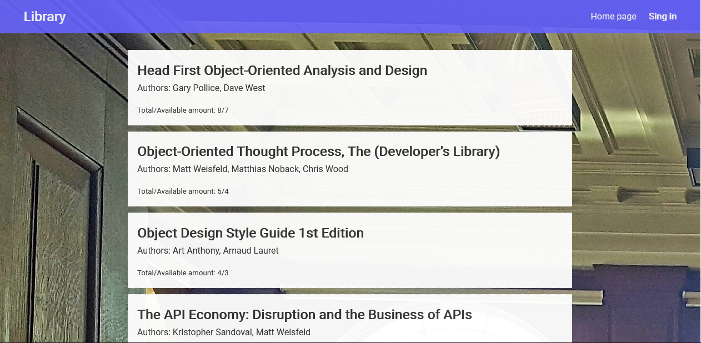
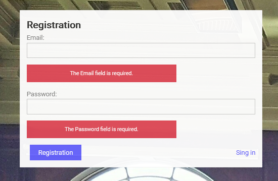
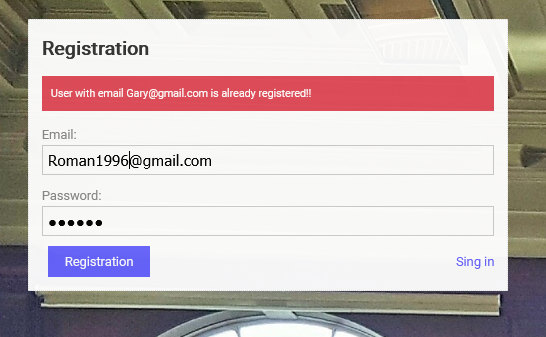
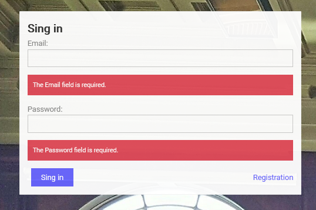
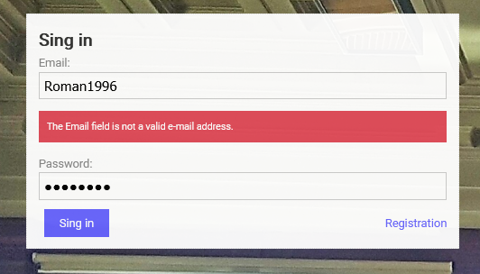
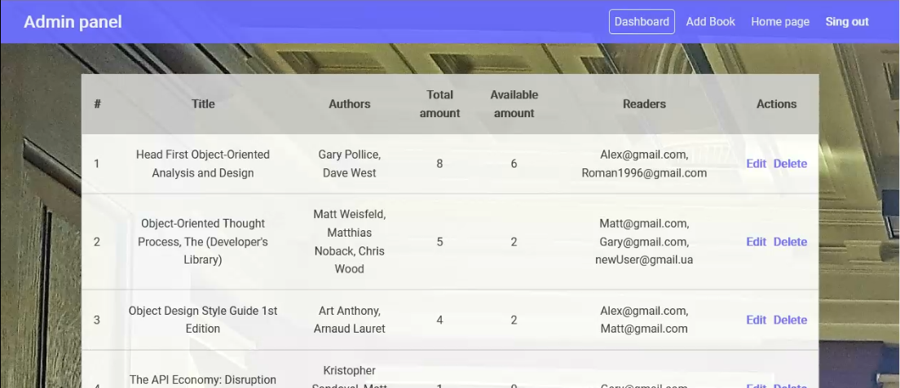
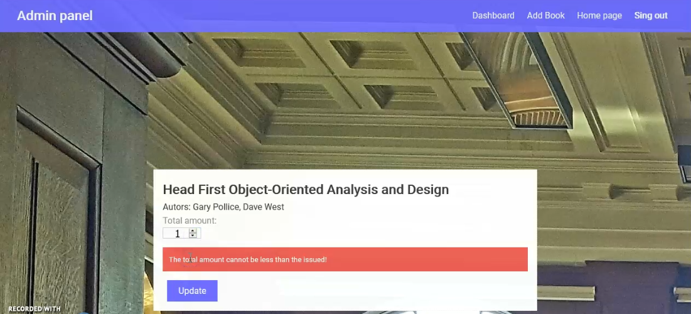
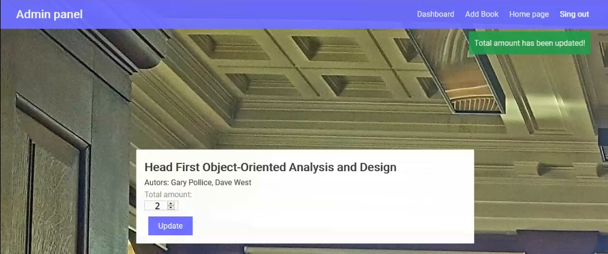

>**_Library Aplication_** is a movie database and website. The database contains information about films, television series, as well as information about actors, directors, screenwriters and other personalities associated with the world of cinema.<br>
On the site, unauthorized users have the opportunity to get acquainted with the latest news feed, view the latest additions of new films and series. Also on the site there is a page dedicated to the stars of the cinema.
The site is localized for three languages ​​- Russian, Ukrainian and English.
Any interested user of the site can register. After registration and authorization on the site, the user's personal account is available with a section of selected films and series.

## Created with
- Node.js
- ASP.NET Core, Web API
- Angilar 8.0

## Clone
- Clone this repo to your local machine using 
``` 
https://github.com/IgorNazaryok/Library-application
```

## Features
- New user registration
- User authorization
- Home page
- Page "My books"
- Admin panel with pages:
- Dashboard page
- Add book page
- Edit book page

---


> ### Unauthorized users

Для не авторизованых пользователей на домашней странице доступен список имеющихся в базе книг с правом на просмотр. Любой не авторизованый пользователь может ознакомится с перечнем имеющихся в базе книг. Доступна следующая информация о книге:
Название книги, автор (или авторы), общее количество книг в базе библиотеки, доступное количество книг.
Для авторизации/регистрации пользователю доступна ссылка в правом верхнем углу с соответствующим функционалом. Для удобного возврата на главную страницу реализована ссылка "Home page".<br>



> ### Registration
Регистрация в приложении позволяет получить доступ к функционалу "Take/Return book" и к странице "My book". Для регистрации  приложении необходимо перейти на страницы регистрации с помощь ссылки "Sing In" расположенной в правой части заголовка приложения, далее выбрать регистрация.
На странице реализована следующая валидация полей:
- поле email и пароль не пустые; 
- поле email является корректным электронным адресом;
- введенный электронный адрес уникален и отсутствует в базе;
- длина поля пароль от 6 до 20 символов.<br>
### [**Registration demo video.**](https://youtu.be/e1mO3riCRNU)
<br><br>



> ### Sing In
Для получения доступа к функционалу "Take/Return book" и страницы "My book" необходимо автороизоваться в приложении. Для авторизации в приложении необходимо перейти на страницы входа с помощь ссылки "Sing In" расположенной в правой части заголовка приложения, далее выбрать вход. Для авторизации в приложении необходимо ввести корректный логин, которым является email и пароль. В влючае не нахождения в базе пользователя с указанным email и паролем будет выдано предупреждение о не коррктности введеннфх учетных данных, вход не выполнен.<br>

<br>
После успешной авторизации пользователю доступен функционал "Take/Return book" и страница "My book".<br>

### [**Sing In demo video.**](https://youtu.be/FM8aUBduBT4)
<br>

> ### My book Page 
Страница "My book" предназначена для отображения списка уже взятых пользователем книг. После первого входа список взятых книг на странице "My book" пуст, пользователю выведено соответствующее сообщение.<br>
.png)
.png)
.png)<br>

### [**My book Page video**](https://youtu.be/A8V7Z6T0lAI)
<br>

> ### Sing in admin panel
Для получения доступа к панели администратора необходимо автороизоваться в приложении с учетными данными администратора. Для авторизации в приложении необходимо перейти на страницы входа с помощь ссылки "Sing In" расположенной в правой части заголовка приложения, далее выбрать вход. Если вход уже выполнен под учетной записью другого пользователя - необходимо выполнить выход с помощь ссылки "Sing Out".
<br>
### [**Sing in admin panel video**](https://youtu.be/q7QLS-zCOwc)
<br>

> ### Admin panel. 
Панель предоставляет функционал добавления, редактирования, удаления имеющихся в базе книг.<br>

<br>

- ### Edit book 
Страница "Edit book" позволяет изменить общее количество книг в базе библиотеки. Реализована валидация поля изменяющего общего количество книг - общее количество не можен быть меньше количества выданых книг. При нарушении данного правила приложение выдает соответствующее предупреждение, количество не изменяется. После успешного изменения количества, система отображает соответствующее сообщение в верхней правой части.<br>

<br>
<br> 
### [**Edit book video**](https://youtu.be/6E7cYWqadrE)
<br> 

- ### Create book 
Страница "Create book" позволяет добавить новую книгу в базу. Реализована валидация поле названия книги и общего количества книг. Поле названия книги проверятся на пустоту, количество книг не менее одной книги.<br>
<br>
<br> 
### [**Create book video**](https://youtu.be/BGVN-AxPVIA)

<br>

>### Contact Information
 ***Nazaryok Igor*** <br>
> e-mail: igor.nazarek@gmail.com <br>
Linkedin: http://www.linkedin.com/in/igor-nazaryok
