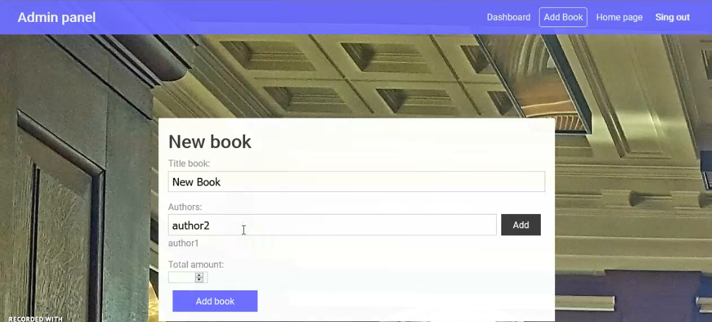

>**_Library Aplication_**. 
Implementation of a simplified version of the library application.
The app provides the following features:
management of books available in the library: adding, deleting, changing the number. Each book can have multiple authors, an author can write multiple books (many-to-many relationship).
the book can be borrowed by different people and at different times;
Registration is required to receive books. The user must be able to register (a token is used for this task);
the "admin" user role is required to manage book availability;

## Created with
- Node.js
- ASP.NET Core 3.1, Web API
- Angilar 8.0

## Clone
- Clone this repo to your local machine using 
``` 
https://github.com/IgorNazaryok/Library-application
```

## Features
- New user registration
- User authorization
- Home page
- Page "My books"
- Admin panel with pages:
- Dashboard page
- Add book page
- Edit book page

---


> ### Unauthorized users

For unauthorized users, a list of books available in the database with the right to view is available on the home page. Any unauthorized user can get acquainted with the list of books available in the database. The following information about the book is available:
Book title, author (or authors), total number of books in the library database, available number of books.
For authorization / registration, the user has a link in the upper right corner with the corresponding functionality. For a convenient return to the main page, the link "Home page" has been implemented. <br>


> ### Registration
Registration in the application allows you to access the "Take/Return" book functionality and the My book page. To register the application, go to the registration page using the "Sing In" link located on the right side of the application title, then select registration.
The page has the following field validation:
- the email and password fields are not empty;
- the email field is a valid email address;
- the entered email address is unique and does not exist in the database;
- the length of the password field is from 6 to 20 characters. <br>
### [**Registration demo video.**](https://youtu.be/e1mO3riCRNU)
<br><br>


> ### Sing In
To access the "Take/Return" book functionality and the My book page, you need to authorize in the application. For authorization in the application, you need to go to the login page using the "Sing In" link located on the right side of the application header, then select the input. For authorization in the application, you must enter the correct login, which is an email and password. If the user is not in the user base with the specified email and password, a warning will be issued about the entered credentials are not correct, login failed. <br>

<br>
After successful authorization, the user can access the "Take / Return book" functionality and the "My book" page. <br>

### [**Sing In demo video.**](https://youtu.be/FM8aUBduBT4)
<br>

> ### My book Page 
The "My book" page is designed to display a list of books already taken by the user. After the first login, the list of borrowed books on the "My book" page is empty, a corresponding message is displayed to the user. <br>
.png)
.png)
.png)<br>

### [**My book Page demo video**](https://youtu.be/A8V7Z6T0lAI)
<br>

> ### Sing in admin panel
To access the admin panel, you must authorize in the application with administrator credentials. For authorization in the application, you need to go to the login page using the "Sing In" link located on the right side of the application header, then select the input. If you have already logged in under the account of another user, you must log out using the "Sing Out" link.
<br>
### [**Sing in admin panel demo video**](https://youtu.be/q7QLS-zCOwc)
<br>

> ### Admin panel. 
The panel provides functionality for adding, editing, deleting books available in the database. <br>

<br>

- ### Edit book 
The "Edit book" page allows you to change the total number of books in the library base. Implemented field validation that changes the total number of books - the total number cannot be less than the number of issued books. If this rule is violated, the application issues a corresponding warning, the quantity does not change. After successfully changing the quantity, the system displays a corresponding message in the upper right part. <br>

<br>
<br> 
### [**Edit book demo video**](https://youtu.be/6E7cYWqadrE)
<br> 

- ### Create book 
The "Create book" page allows you to add a new book to the database. Implemented validation of the book title field and the total number of books. The book title field is checked for emptiness, the number of books is at least one book. <br>

 <br>
<br> 
### [**Create book demo video **](https://youtu.be/BGVN-AxPVIA)

<br>

>### Contact Information
 ***Nazaryok Igor*** <br>
> e-mail: igor.nazarek@gmail.com <br>
Linkedin: http://www.linkedin.com/in/igor-nazaryok
